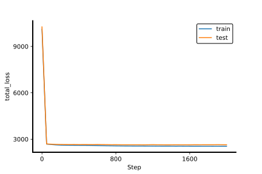
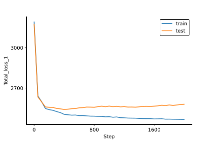
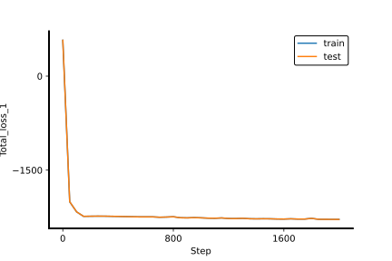
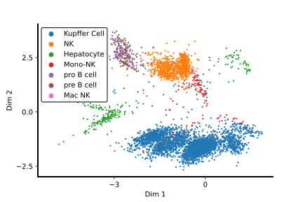
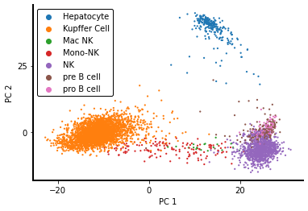
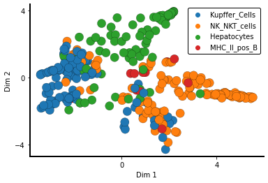
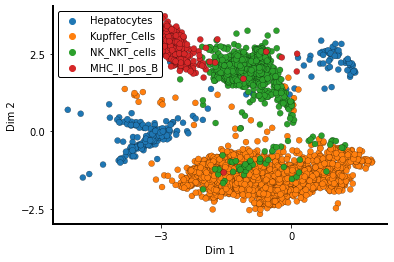
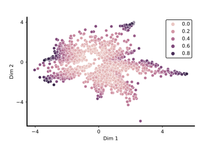

# siVAE tutorial

## System setup

Import requiured packages and set debugging/logging information


```python
## System
import os
os.environ['TF_CPP_MIN_LOG_LEVEL']  = '3'  # no debugging from TF
os.environ['TF_CPP_MIN_VLOG_LEVEL'] = '3'

import logging
logging.getLogger('tensorflow').disabled = True
logging.getLogger().setLevel(logging.INFO)

## Tensorflow
import tensorflow as tf
tf.get_logger().setLevel('INFO')
tf.logging.set_verbosity(tf.logging.ERROR)
tf.compat.v1.logging.set_verbosity(tf.compat.v1.logging.ERROR)

## Scanpy
import scanpy as sc
```

Set up the configuration for tensorflow based on local machine.


```python
#### Set up tf config
gpu_device = '0'
os.environ["CUDA_VISIBLE_DEVICES"]  = gpu_device
config = tf.ConfigProto()
config.gpu_options.allow_growth = True
config.log_device_placement = True
config.allow_soft_placement = True
config.intra_op_parallelism_threads = 5
config.inter_op_parallelism_threads = 5
```

## Import preprocessed data (expression matrix)

Import preprocessed data that was processed with log-normalization, highly variable gene selection, and center and scaling through scanpy.


```python
from siVAE.data.data_handler import data2handler

adata = sc.read_h5ad('sample_fetal_liver_atlas_dataset.h5ad')
datah_sample, datah_feature, plot_args = data2handler(adata)

#### Setup the train/test/validation split
k_split=0.8
datah_sample.create_split_index_list(k_split=k_split,random_seed=0)
```

## Set model parameters and run siVAE

Set training and model parameters for siVAE.


```python
#### Training Parameters
iter          = 2000
mb_size       = 0.2
l2_scale      = 1e-3
keep_prob     = 1
learning_rate = 1e-4
early_stop    = False
decay_rate    = 0.9

#### Model parameters
# Architecture should be a string with a specific format
# architecture: "Encoder-LE-Decoder-Output (0)-Index of LE"
architecture = '1024-512-128-LE-128-512-1024-0-3'
decoder_activation = 'NA'
zv_recon_scale = 0.1
LE_dim = 2
datah_sample.create_dataset(kfold_idx=0)

#### Set parameters

graph_args = {'LE_dim'       : LE_dim,
              'architecture' : architecture,
              'config'       : config,
              'iter'         : iter,
              'mb_size'      : mb_size,
              'l2_scale'     : l2_scale,
              'tensorboard'  : True,
              'batch_norm'   : False,
              'keep_prob'    : keep_prob,
              'log_frequency': 50,
              'learning_rate': learning_rate,
              "early_stopping"   : early_stop,
              "validation_split" : 0,
              "decay_rate"       : decay_rate,
              "decay_steps"      : 1000,
              'var_dependency'   : True,
              'activation_fun'   : tf.nn.relu,
              'activation_fun_decoder': tf.nn.relu,
              'output_distribution': 'normal',
              'beta'               : 1,
              'l2_scale_final'     : 5e-3,
              'log_variational'    : False,
              'beta_warmup'        : 1000,
              'max_patience_count' : 100}

logdir='out_test'
graph_args['logdir_tf'] = logdir
os.makedirs(logdir,exist_ok=True)

```
Running siVAE will output the results as siVAE_output which includes the cell and feature embeddings as well as train information.

```python
from siVAE.run_model import run_VAE

siVAE_output = run_VAE(graph_args_sample=graph_args,
                        LE_method='siVAE',
                        datah_sample=datah_sample,
                        datah_feature=datah_feature)
```

    siVAE?
    Device mapping:
    /job:localhost/replica:0/task:0/device:XLA_CPU:0 -> device: XLA_CPU device
    /job:localhost/replica:0/task:0/device:XLA_GPU:0 -> device: XLA_GPU device
    /job:localhost/replica:0/task:0/device:GPU:0 -> device: 0, name: GeForce GTX 1080 Ti, pci bus id: 0000:01:00.0, compute capability: 6.1

    ...
    ...

Save the result into pickle.


```python
siVAE_output.save(filename=os.path.join(logdir,'result.pickle'))
```

## Check model trained properly through metrics from tensorboard

Plot and save the scalar values saved in tensorboard


```python
from siVAE.model.output.plot import plot_scalars
plot_scalars(siVAE_output, os.path.join(logdir,'plot'))
```

Display the scalar values


```python
from IPython.core.display import SVG
SVG(filename=os.path.join(logdir,'plot','scalars','combinedModel_1-total_loss.svg'))
```





```python
SVG(filename=os.path.join(logdir,'plot','scalars','VAE_sample-Total_loss_1.svg'))
```





```python
SVG(filename=os.path.join(logdir,'plot','scalars','VAE_feature-Total_loss_1.svg'))
```





## Plot cell embeddings for visualization


```python
from siVAE.model.output import plot

kwargs={'s':5,'edgecolor':"none"}

plot.plot_latent_embeddings(siVAE_output,logdir=logdir,
                            filename='CellEmbeddings.svg',
                            show_legend=True,
                            **kwargs)

SVG(filename=os.path.join(logdir,'CellEmbeddings.svg'))

```





Plot PCA of the expression matrix for comparison


```python
import pandas as pd

import matplotlib
import matplotlib.pyplot as plt
import matplotlib.colors as colors
import seaborn as sns

from siVAE.util import reduce_dimensions

dimred_method = 'PCA'
palette   = plot_args['palette']
hue_order = plot_args['hue_order']

#### For Dim
X_out, dim_labels = reduce_dimensions(datah_sample.X.X, reduced_dimension = 2, method = dimred_method)
y = datah_sample.X.obs['Cell Type']
## Plot
from siVAE.util import remove_spines
kwargs={'s':5,'edgecolor':"none"}
labels_test = y.to_numpy()
df_plot = pd.concat([pd.DataFrame(X_out), pd.DataFrame(labels_test)], axis = 1)
df_plot.columns = dim_labels + ["Label"]
ax = sns.scatterplot(x = dim_labels[0], y = dim_labels[1], hue = "Label", data = df_plot, palette = palette, hue_order = hue_order, **kwargs)
remove_spines(ax)
# ax.legend_.remove()
plt.savefig(os.path.join(logdir,'{}.svg'.format(dimred_method)))
# plt.close()
```





```python
from siVAE.util import reduce_dimensions
import pandas as pd

## Plots
import matplotlib
import matplotlib.pyplot as plt
import matplotlib.colors as colors
import seaborn as sns

dimred_method = 'tSNE'
palette   = plot_args['palette']
hue_order = plot_args['hue_order']

#### For Dim
X_out, dim_labels = reduce_dimensions(datah_sample.X.X, reduced_dimension = 2, method = dimred_method)
y = datah_sample.X.obs['Cell Type']

## Plot
from siVAE.util import remove_spines
kwargs={'s':5,'edgecolor':"none"}
labels_test = y.to_numpy()
df_plot = pd.concat([pd.DataFrame(X_out), pd.DataFrame(labels_test)], axis = 1)
df_plot.columns = dim_labels + ["Label"]
ax = sns.scatterplot(x = dim_labels[0], y = dim_labels[1], hue = "Label", data = df_plot, palette = palette, hue_order = hue_order, **kwargs)
remove_spines(ax)
# ax.legend_.remove()
plt.savefig(os.path.join(logdir,'{}.svg'.format(dimred_method)))
# plt.close()
```


## Plot feature embeddings

Plot feature embeddings colored based on which cell type's marker genes they belong to.


```python
## Scatterplot with Geneset Annotations --------------------------------------

import numpy as np
import gseapy as gp

logdir_gsea = os.path.join(logdir,'GSEA')
os.makedirs(logdir_gsea,exist_ok=True)

genesets = {"scsig":"/home/yongin/projects/siVAE/data/MSigDB/scsig.all.v1.0.1.symbols.gmt",
            "Hallmark":"/home/yongin/projects/siVAE/data/MSigDB/h.all.v7.1.symbols.gmt",
            "KEGG":"/home/yongin/projects/siVAE/data/MSigDB/c2.cp.kegg.v7.1.symbols.gmt"}

##
gs_dict = gp.parser.gsea_gmt_parser(genesets['scsig'])

## Filter genesets to Aizarani liver cells
gs_use = [k for k in gs_dict.keys() if 'AIZARANI_LIVER' in k.upper()]
gs_dict = {gs:gs_v for gs,gs_v in gs_dict.items() if gs in gs_use}

## Combine genesets with similar names
gs_name_mapping = {k: "_".join(k.split('_')[3:-1]) for k in gs_dict.keys()}
gs_dict_new = {gs:np.array([]) for gs in np.unique([v for v in gs_name_mapping.values()])}
for gs_name,gs_name2 in gs_name_mapping.items():
    gs_dict_new[gs_name2] = np.union1d(gs_dict_new[gs_name2],gs_dict[gs_name])

## Set selected cell type/group
selected_ct = ('Hepatocytes',
               'Kupffer_Cells',
               'NK_NKT_cells',
               'MHC_II_pos_B')
gs_dict_comb_subset = {k: gs_dict_new[k] for k in selected_ct}

## Get mutually exclusive sets
gs_dict_excl = {}
for gs_name, gs_genes in gs_dict_comb_subset.items():
    for gs_name2, gs_genes2 in gs_dict_new.items():
        if gs_name != gs_name2:
            gs_genes = np.setdiff1d(gs_genes,gs_genes2)
    gs_dict_excl[gs_name] = gs_genes

## Create data frame where each rows are genes and columns are metadata/stat
gene_embeddings = siVAE_output.get_feature_embeddings()
gene_names      = siVAE_output.get_model().get_value('var_names')
X_plot, dim_labels = reduce_dimensions(gene_embeddings, reduced_dimension = 2)
df_plot = pd.concat([pd.DataFrame(X_plot), pd.DataFrame(gene_names)], axis = 1)
df_plot.columns = dim_labels + ["Label"]
df_plot.index = gene_names

df_plot['Geneset'] = 'None'
gs_dict_in = gs_dict_excl
for gs_,genes in gs_dict_in.items():
    df_plot['Geneset'].loc[np.isin(df_plot.index,genes)] = gs_

df_plot = df_plot[df_plot.Geneset != 'None']
ax = sns.scatterplot(x = dim_labels[0], y = dim_labels[1],
                     hue = 'Geneset', data = df_plot,
                     edgecolor='black',linewidth=0.2,s=150)
remove_spines(ax)

```

    INFO:root:User Defined gene sets is given.......continue..........
    INFO:root:0008 gene_sets have been filtered out when max_size=1000 and min_size=3
    /home/yongin/virtualenv/siVAE_repo/lib/python3.6/site-packages/pandas/core/indexing.py:670: SettingWithCopyWarning:
    A value is trying to be set on a copy of a slice from a DataFrame

    See the caveats in the documentation: https://pandas.pydata.org/pandas-docs/stable/user_guide/indexing.html#returning-a-view-versus-a-copy
      iloc._setitem_with_indexer(indexer, value)





Re-plot the cell embeddings, this time where the sub cell type labels have been grouped to match the cell type labels in marker gene sets.


```python
cell_embeddings = siVAE_output.get_sample_embeddings()
cell_labels = siVAE_output.get_model().get_value('labels')
X_plot, dim_labels = reduce_dimensions(cell_embeddings, reduced_dimension = 2)
df_plot = pd.concat([pd.DataFrame(X_plot), pd.DataFrame(cell_labels)], axis = 1)
df_plot.columns = dim_labels + ["Label"]
df_plot.index = cell_labels

## Set cell type groupings
cell_labels_dict = {k:k for k in np.unique(cell_labels)}
cell_labels_dict['Hepatocyte'] = 'Hepatocytes'
cell_labels_dict['Kupffer Cell'] = 'Kupffer_Cells'
cell_labels_dict['NK'] = 'NK_NKT_cells'
cell_labels_dict['Mono-NK'] = 'NK_NKT_cells'
cell_labels_dict['Mac NK'] = 'NK_NKT_cells'
cell_labels_dict['pro B cell'] = 'MHC_II_pos_B'
cell_labels_dict['pre B cell'] = 'MHC_II_pos_B'
cell_labels_dict['pre pro B cell'] = 'MHC_II_pos_B'
cell_labels_2 = [cell_labels_dict[c] for c in cell_labels]

df_plot['Label'] = cell_labels_2
df_plot_ = df_plot
df_plot_ = df_plot_[np.isin(df_plot_['Label'],selected_ct)]
df_plot_['Label'] = df_plot_['Label'].astype('category')
df_plot_['Label'].cat.set_categories(selected_ct,inplace=True)
df_plot_.sort_values('Label',inplace=True)
ax = sns.scatterplot(x = dim_labels[0], y = dim_labels[1], hue = 'Label', data = df_plot_,
                     edgecolor='black',linewidth=0.2)
remove_spines(ax)
# ax.legend_.remove()
# plt.savefig(os.path.join(logdir_gsea,'cell_embeddings_subset.svg'))
# plt.close()
```





## Infer neighborhood genes

Infer the neighborhood genes of a query gene based on the distance in feature embeddings. The closer two genes are in the feature embedding space, the more likely they are neighbors.


```python
from siVAE.model.output import neighborhood
import numpy as np

similarity_matrix = neighborhood.extract_similarity_matrix(siVAE_output,method='siVAE',category='siVAE')
similarity_matrix = similarity_matrix[0]['siVAE'].iloc[:20]

np.argsort(similarity_matrix,axis=1)

```


<div>
<style scoped>
    .dataframe tbody tr th:only-of-type {
        vertical-align: middle;
    }

    .dataframe tbody tr th {
        vertical-align: top;
    }

    .dataframe thead th {
        text-align: right;
    }
</style>
<table border="1" class="dataframe">
  <thead>
    <tr style="text-align: right;">
      <th></th>
      <th>ISG15</th>
      <th>AURKAIP1</th>
      <th>MRPL20</th>
      <th>GNB1</th>
      <th>FAAP20</th>
      <th>RER1</th>
      <th>TNFRSF14</th>
      <th>PARK7</th>
      <th>ENO1</th>
      <th>RBP7</th>
      <th>...</th>
      <th>MT-CO2</th>
      <th>MT-ATP8</th>
      <th>MT-ATP6</th>
      <th>MT-CO3</th>
      <th>MT-ND3</th>
      <th>MT-ND4L</th>
      <th>MT-ND4</th>
      <th>MT-ND5</th>
      <th>MT-ND6</th>
      <th>MT-CYB</th>
    </tr>
  </thead>
  <tbody>
    <tr>
      <th>ISG15</th>
      <td>826</td>
      <td>1901</td>
      <td>1243</td>
      <td>519</td>
      <td>1096</td>
      <td>1719</td>
      <td>1678</td>
      <td>1249</td>
      <td>1350</td>
      <td>1025</td>
      <td>...</td>
      <td>399</td>
      <td>505</td>
      <td>1978</td>
      <td>1226</td>
      <td>1971</td>
      <td>402</td>
      <td>619</td>
      <td>698</td>
      <td>1305</td>
      <td>0</td>
    </tr>
    <tr>
      <th>AURKAIP1</th>
      <td>826</td>
      <td>1901</td>
      <td>1243</td>
      <td>519</td>
      <td>737</td>
      <td>1096</td>
      <td>1719</td>
      <td>1678</td>
      <td>1249</td>
      <td>336</td>
      <td>...</td>
      <td>811</td>
      <td>546</td>
      <td>1847</td>
      <td>1524</td>
      <td>1670</td>
      <td>1109</td>
      <td>1507</td>
      <td>679</td>
      <td>963</td>
      <td>1</td>
    </tr>
    <tr>
      <th>MRPL20</th>
      <td>826</td>
      <td>1901</td>
      <td>1243</td>
      <td>519</td>
      <td>737</td>
      <td>1096</td>
      <td>1719</td>
      <td>1678</td>
      <td>1249</td>
      <td>1350</td>
      <td>...</td>
      <td>1847</td>
      <td>1524</td>
      <td>1670</td>
      <td>1651</td>
      <td>1810</td>
      <td>210</td>
      <td>1962</td>
      <td>453</td>
      <td>62</td>
      <td>2</td>
    </tr>
    <tr>
      <th>GNB1</th>
      <td>1901</td>
      <td>519</td>
      <td>1243</td>
      <td>1096</td>
      <td>826</td>
      <td>1719</td>
      <td>1678</td>
      <td>1249</td>
      <td>1350</td>
      <td>1025</td>
      <td>...</td>
      <td>1982</td>
      <td>1323</td>
      <td>1488</td>
      <td>77</td>
      <td>996</td>
      <td>88</td>
      <td>1264</td>
      <td>1149</td>
      <td>1317</td>
      <td>3</td>
    </tr>
    <tr>
      <th>FAAP20</th>
      <td>826</td>
      <td>1901</td>
      <td>519</td>
      <td>1243</td>
      <td>1096</td>
      <td>1719</td>
      <td>1678</td>
      <td>1249</td>
      <td>223</td>
      <td>407</td>
      <td>...</td>
      <td>793</td>
      <td>1522</td>
      <td>1832</td>
      <td>1406</td>
      <td>482</td>
      <td>919</td>
      <td>930</td>
      <td>226</td>
      <td>805</td>
      <td>4</td>
    </tr>
    <tr>
      <th>RER1</th>
      <td>223</td>
      <td>407</td>
      <td>495</td>
      <td>1061</td>
      <td>176</td>
      <td>204</td>
      <td>1152</td>
      <td>1199</td>
      <td>1432</td>
      <td>457</td>
      <td>...</td>
      <td>1975</td>
      <td>1209</td>
      <td>1037</td>
      <td>230</td>
      <td>1207</td>
      <td>441</td>
      <td>1922</td>
      <td>1934</td>
      <td>12</td>
      <td>5</td>
    </tr>
    <tr>
      <th>TNFRSF14</th>
      <td>826</td>
      <td>1901</td>
      <td>1243</td>
      <td>519</td>
      <td>1096</td>
      <td>1719</td>
      <td>1678</td>
      <td>1249</td>
      <td>1350</td>
      <td>1025</td>
      <td>...</td>
      <td>575</td>
      <td>537</td>
      <td>1219</td>
      <td>632</td>
      <td>832</td>
      <td>1685</td>
      <td>343</td>
      <td>1302</td>
      <td>915</td>
      <td>6</td>
    </tr>
    <tr>
      <th>PARK7</th>
      <td>826</td>
      <td>265</td>
      <td>625</td>
      <td>737</td>
      <td>319</td>
      <td>1455</td>
      <td>1420</td>
      <td>1893</td>
      <td>624</td>
      <td>375</td>
      <td>...</td>
      <td>1235</td>
      <td>1344</td>
      <td>1229</td>
      <td>681</td>
      <td>1895</td>
      <td>1107</td>
      <td>753</td>
      <td>243</td>
      <td>1576</td>
      <td>7</td>
    </tr>
    <tr>
      <th>ENO1</th>
      <td>826</td>
      <td>1901</td>
      <td>1243</td>
      <td>519</td>
      <td>265</td>
      <td>1096</td>
      <td>1719</td>
      <td>625</td>
      <td>1678</td>
      <td>1455</td>
      <td>...</td>
      <td>1362</td>
      <td>80</td>
      <td>1285</td>
      <td>29</td>
      <td>829</td>
      <td>618</td>
      <td>468</td>
      <td>217</td>
      <td>848</td>
      <td>8</td>
    </tr>
    <tr>
      <th>RBP7</th>
      <td>1901</td>
      <td>519</td>
      <td>1243</td>
      <td>1096</td>
      <td>1719</td>
      <td>1678</td>
      <td>1249</td>
      <td>1350</td>
      <td>1025</td>
      <td>1762</td>
      <td>...</td>
      <td>1166</td>
      <td>694</td>
      <td>1316</td>
      <td>1876</td>
      <td>1723</td>
      <td>1408</td>
      <td>1144</td>
      <td>1575</td>
      <td>759</td>
      <td>9</td>
    </tr>
    <tr>
      <th>PGD</th>
      <td>223</td>
      <td>407</td>
      <td>495</td>
      <td>1061</td>
      <td>176</td>
      <td>204</td>
      <td>1152</td>
      <td>1199</td>
      <td>1432</td>
      <td>457</td>
      <td>...</td>
      <td>1833</td>
      <td>1922</td>
      <td>1611</td>
      <td>473</td>
      <td>276</td>
      <td>18</td>
      <td>858</td>
      <td>40</td>
      <td>57</td>
      <td>10</td>
    </tr>
    <tr>
      <th>TNFRSF1B</th>
      <td>826</td>
      <td>1901</td>
      <td>1243</td>
      <td>519</td>
      <td>1096</td>
      <td>1719</td>
      <td>1678</td>
      <td>1249</td>
      <td>1350</td>
      <td>1025</td>
      <td>...</td>
      <td>279</td>
      <td>1708</td>
      <td>194</td>
      <td>639</td>
      <td>649</td>
      <td>621</td>
      <td>1652</td>
      <td>637</td>
      <td>648</td>
      <td>11</td>
    </tr>
    <tr>
      <th>DHRS3</th>
      <td>223</td>
      <td>407</td>
      <td>495</td>
      <td>1061</td>
      <td>176</td>
      <td>204</td>
      <td>1152</td>
      <td>1199</td>
      <td>1432</td>
      <td>457</td>
      <td>...</td>
      <td>936</td>
      <td>441</td>
      <td>1975</td>
      <td>1207</td>
      <td>1037</td>
      <td>230</td>
      <td>1934</td>
      <td>1922</td>
      <td>5</td>
      <td>12</td>
    </tr>
    <tr>
      <th>EFHD2</th>
      <td>223</td>
      <td>407</td>
      <td>495</td>
      <td>1061</td>
      <td>176</td>
      <td>204</td>
      <td>1152</td>
      <td>1199</td>
      <td>1596</td>
      <td>494</td>
      <td>...</td>
      <td>1095</td>
      <td>819</td>
      <td>21</td>
      <td>290</td>
      <td>388</td>
      <td>1562</td>
      <td>889</td>
      <td>110</td>
      <td>1087</td>
      <td>13</td>
    </tr>
    <tr>
      <th>NECAP2</th>
      <td>1901</td>
      <td>519</td>
      <td>1243</td>
      <td>1096</td>
      <td>1719</td>
      <td>1678</td>
      <td>1249</td>
      <td>826</td>
      <td>1350</td>
      <td>1025</td>
      <td>...</td>
      <td>170</td>
      <td>1048</td>
      <td>26</td>
      <td>1659</td>
      <td>531</td>
      <td>790</td>
      <td>1820</td>
      <td>1918</td>
      <td>1348</td>
      <td>14</td>
    </tr>
    <tr>
      <th>SDHB</th>
      <td>1901</td>
      <td>519</td>
      <td>1243</td>
      <td>1096</td>
      <td>1719</td>
      <td>1678</td>
      <td>1249</td>
      <td>1350</td>
      <td>826</td>
      <td>1025</td>
      <td>...</td>
      <td>428</td>
      <td>112</td>
      <td>1982</td>
      <td>814</td>
      <td>538</td>
      <td>990</td>
      <td>1189</td>
      <td>1082</td>
      <td>913</td>
      <td>15</td>
    </tr>
    <tr>
      <th>AKR7A2</th>
      <td>826</td>
      <td>1901</td>
      <td>519</td>
      <td>1243</td>
      <td>265</td>
      <td>1096</td>
      <td>1719</td>
      <td>625</td>
      <td>1455</td>
      <td>223</td>
      <td>...</td>
      <td>717</td>
      <td>524</td>
      <td>206</td>
      <td>1630</td>
      <td>769</td>
      <td>367</td>
      <td>785</td>
      <td>1308</td>
      <td>1259</td>
      <td>16</td>
    </tr>
    <tr>
      <th>CAPZB</th>
      <td>1901</td>
      <td>519</td>
      <td>1243</td>
      <td>1096</td>
      <td>1719</td>
      <td>1678</td>
      <td>1249</td>
      <td>1350</td>
      <td>1025</td>
      <td>1762</td>
      <td>...</td>
      <td>533</td>
      <td>182</td>
      <td>1415</td>
      <td>1561</td>
      <td>254</td>
      <td>377</td>
      <td>1530</td>
      <td>246</td>
      <td>376</td>
      <td>17</td>
    </tr>
    <tr>
      <th>MINOS1</th>
      <td>223</td>
      <td>407</td>
      <td>495</td>
      <td>1061</td>
      <td>176</td>
      <td>204</td>
      <td>1152</td>
      <td>1199</td>
      <td>1432</td>
      <td>457</td>
      <td>...</td>
      <td>1833</td>
      <td>860</td>
      <td>1611</td>
      <td>784</td>
      <td>10</td>
      <td>1842</td>
      <td>1843</td>
      <td>1716</td>
      <td>473</td>
      <td>18</td>
    </tr>
    <tr>
      <th>DDOST</th>
      <td>1901</td>
      <td>519</td>
      <td>1243</td>
      <td>1096</td>
      <td>826</td>
      <td>1719</td>
      <td>1678</td>
      <td>1249</td>
      <td>1350</td>
      <td>1025</td>
      <td>...</td>
      <td>1896</td>
      <td>1469</td>
      <td>540</td>
      <td>263</td>
      <td>925</td>
      <td>160</td>
      <td>140</td>
      <td>924</td>
      <td>559</td>
      <td>19</td>
    </tr>
  </tbody>
</table>
<p>20 rows × 2000 columns</p>
</div>


Calculate how accurately neighborhood genes predict the expression of query genes. This serves as a metric of how well siVAE predicts neighborhood genes in comparison to other methods especially those based on GCN inference. This calculation will take considerable amount of time (10+ hours depending on the system).


```python
# graph_args = {'LE_dim'       : 5,
#               'architecture' : '5-5-5-0-2',
#               'config'       : config,
#               'iter'         : 3000,
#               'mb_size'      : 0.2,
#               'l2_scale'     : 1e-2,
#               'dataAPI'      : False,
#               'tensorboard'  : False,
#               'batch_norm'   : False,
#               'keep_prob'    : 0.9,
#               'log_frequency': 100,
#               'learning_rate': 1e-3,
#               "early_stopping"   : False,
#               "validation_split" : 0,
#               "decay_rate"       : 0.9,
#               "decay_steps"      : 1000,
#               'activation_fun'   : tf.nn.relu,
#               'l2_scale_final'     : 0,
#               'random_seed' :0,
#              'isVAE': False,
#              'name': 'VAE',
#              'decoder_var': 'deterministic'}

# logdir_neighborhood = os.path.join(logdir,'neighborhood','siVAE')

# ## Subset the genes for demonstratation
# import copy

# similarity_matrix_ = similarity_matrix.iloc[:10].iloc[:,:10]
# datah_sample_ = copy.deepcopy(datah_sample)
# datah_sample_.X = datah_sample.X[:,:10]

# df_score = neighborhood.calculate_prediction_accuracy(similarity_matrix,
#                                                       datah_sample_,
#                                                       model_kwargs=graph_args,
#                                                       split_index_list=None,
#                                                       num_neighbors=20,
#                                                       logdir=logdir_neighborhood)


```

## Predict degree centrality of each genes

Infer the degree centrality of each genes and overlay degree centrality on top of the feature embeddings.


```python
from siVAE.model.output import degree_centrality as dc

recons = siVAE_output.get_model().get_value('reconstruction')
recon_loss = np.square(recons[0] - recons[1]).mean(0)
degree_centrality = dc.calculate_degree_centrality(recon_loss=recon_loss)
```


```python
## Plot degree centrality
plot.plot_latent_embeddings(siVAE_output, logdir=logdir, type='Feature',
                            filename='GeneEmbeddingsDegreeCentrality.svg',
                            hue = degree_centrality, show_legend=True)
SVG(os.path.join(logdir,'GeneEmbeddingsDegreeCentrality.svg'))
```





```python

```
